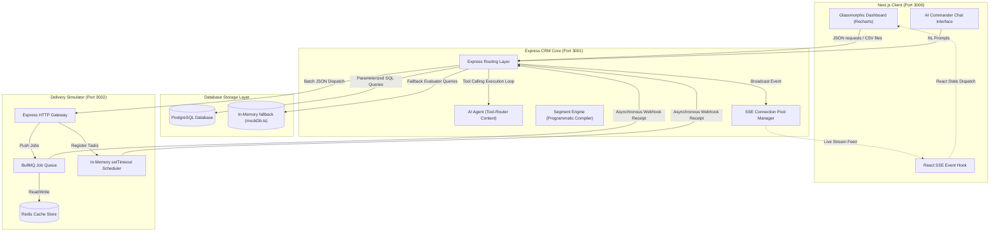
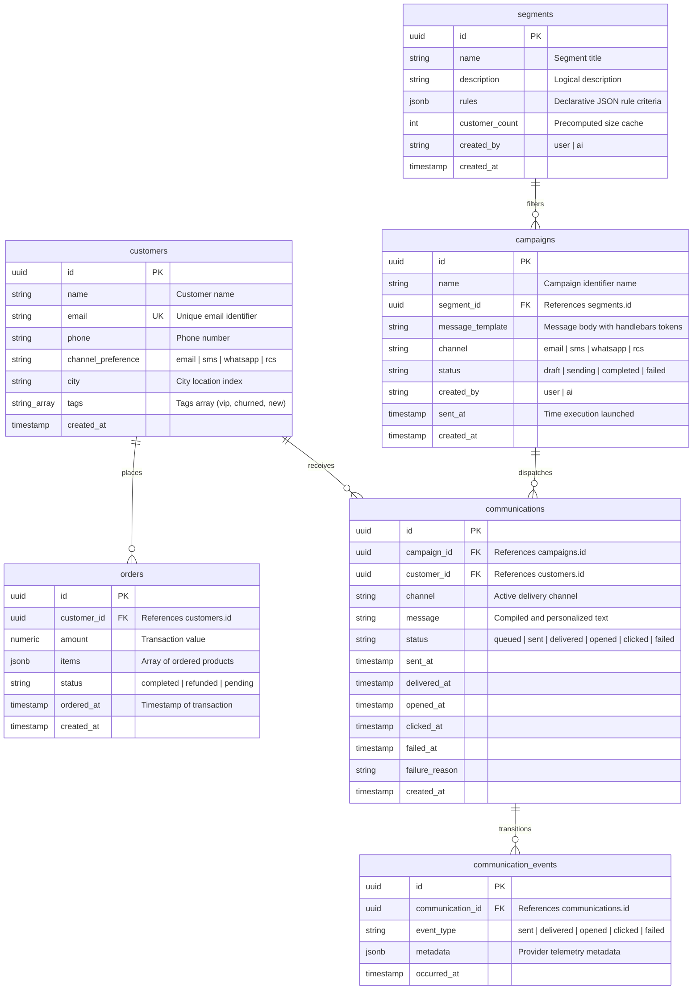
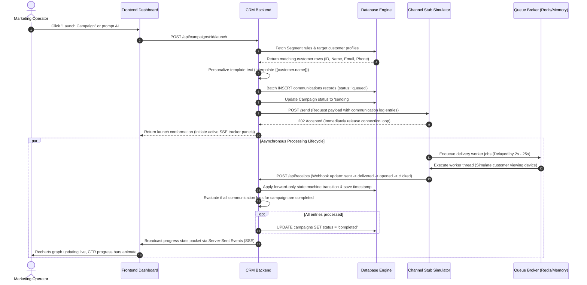
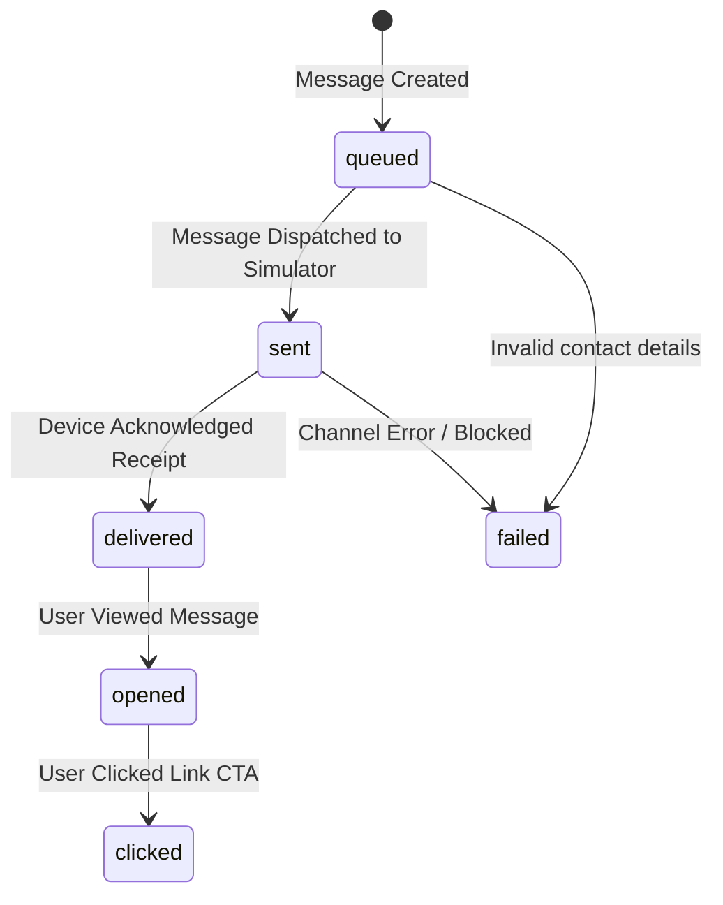
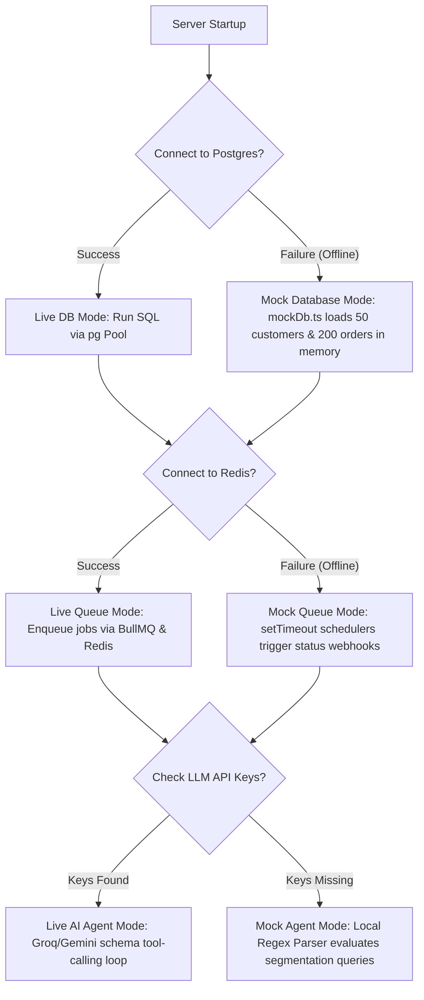

# 🧵 Drape CRM — AI-Native Marketing Operating System
### High-Performance System Design & Architecture Document

Drape CRM is a decoupled, multi-tier marketing operating system designed for real-time customer segmentation, personalization compile-and-dispatch loops, and live campaign engagement tracking. It features an **AI Commander chat interface** that parses natural language into declarative rules (without SQL injection risk), a scalable delivery simulator with dynamic callback loops, and a **zero-dependency fallback architecture** that runs entirely in-memory if Postgres, Redis, or LLM API keys are unconfigured.

---

## 📂 Codebase Directory Structure

```
xeno-mini-crm/
├── README.md                 # System Design Documentation & Quick Start
├── package.json              # Monorepo workspaces coordinator (concurrent runtime)
├── frontend/                 # Next.js 15 Client Application (Port 3000)
│   ├── app/                  # App Router & page directories
│   │   ├── (app)/            # App shell layout (Sidebar, Mobile Overlay drawer)
│   │   │   ├── dashboard/    # KPI metrics, campaign funnel analytics, customer demographics charts
│   │   │   ├── customers/    # Customer directory with filters, CSV importing, manual creation
│   │   │   ├── segments/     # Declarative segment manager (rule selectors, live user count previews)
│   │   │   ├── campaigns/    # Campaign builder & real-time delivery tracking metrics
│   │   │   └── chat/         # AI Commander panel (natural language segmentation/drafting/launching)
│   │   ├── globals.css       # CSS Variables, Tailwind v4 preflights, custom transitions & animations
│   │   ├── layout.tsx        # Global HTML structure (enforcing dark mode theme classes)
│   │   └── page.tsx          # Landing page with visual brand introduction & quick routing
│   ├── components/           # UI Component library
│   │   ├── layout/           # Sidebar.tsx & MobileHeader.tsx (dynamic display/collapse drawers)
│   │   └── ui/               # Standard card, chart, and alert blocks
│   └── lib/                  # Connection clients & SSE event hook listener hooks
├── crm-backend/              # Express CRM Core API Server (Port 3001)
│   ├── src/
│   │   ├── db/               # Database config, migration schema scripts, seeders, mockDb.ts fallback
│   │   ├── routes/           # API endpoints (customers, segments, campaigns, chat, receipts, analytics)
│   │   ├── services/         # Core engines (segmentEngine, campaignEngine, aiAgent, sseManager)
│   │   └── index.ts          # Express server startup hook, connection diagnostics
└── channel-stub/             # Message Delivery Simulator (Port 3002)
    ├── src/
    │   ├── simulation/       # Random delay, status generation (delivered, opened, clicked, failed)
    │   ├── workers/          # BullMQ queue processors for async simulator jobs
    │   └── index.ts          # Stub Server routes & setTimeout callback scheduler fallback
```

---

## 🏗️ System Architecture & Data Flow

Drape CRM separates client state management, database storage, personalization logic, and async message delivery into decoupled, single-responsibility services. 



### 1. Component Responsibility Matrix
* **Frontend (Next.js client)**: Communicates with the backend core via JSON APIs, processes CSV ingestion directly, and handles real-time UI state re-rendering via custom Server-Sent Events hooks.
* **CRM Backend (Express core)**: Exposes endpoints for data operations, runs the segment rules compilation engine, hosts the LLM tool-calling agent loop, and distributes real-time update notifications to active SSE clients.
* **Channel Stub (Simulator)**: Simulates real-world messaging service provider gateways (like SendGrid, Twilio, Meta WhatsApp Business). It accepts bulk message payloads, executes random-delay delivery/click events, and reports them back to the CRM backend webhook.

---

## 🗄️ Database Design (Relational Entity-Relationship Model)

Drape CRM employs a normalized relational structure enforcing strict schema relationships, check constraints, and unique indices to support fast aggregation joins.



### Table Schema Indexing & Rationale
* **`customers.email`**: Marked `UNIQUE` and backed by a B-Tree index to block duplicate profiles and support fast profile retrieval.
* **`orders.customer_id`**: Foreign key indexed to accelerate segment queries that compile aggregations (e.g. `SUM(amount)` or `COUNT(orders)`).
* **`communications.status`**: Indexed to speed up live aggregation sweeps that update campaign telemetry percentages.

---

## 🔄 End-to-End Campaign Dispatch & Event Delivery Pipeline

This diagram shows how a campaign goes from draft state to target resolution, personalization interpolation, async distribution, simulated customer interaction, and live state updates:



---

## 🤖 Natural Language to Structured Rules Compilation

To completely eliminate **SQL Injection (SQLi)** vulnerabilities and avoid corrupted queries, Drape CRM enforces a two-step parsing layer. The AI agent never creates or runs raw SQL strings.

```
[User Text Prompt] 
       │ (e.g., "Delhi customers with > 10,000 spend")
       ▼
 ┌──────────┐
 │ AI Agent │ ──► Map Prompt to structured rules schema via tool definitions
 └──────────┘
       │
       ▼
[SegmentRules JSON]
       │ (e.g., { operator: 'AND', conditions: [{ field: 'city', op: 'eq', value: 'Delhi' }, ...] })
       ▼
 ┌────────────────┐
 │ Segment Engine │ ──► Programmatic Compiler translates JSON to parameterized SQL
 └────────────────┘
       │
       ▼
[Parameterized SQL Query]
       │ (e.g., "SELECT * FROM customers WHERE city = $1 AND total_spend > $2")
       ▼
┌──────────────┐
│ Database Tier│ ──► PostgreSQL evaluates values securely ($1 = "Delhi", $2 = 10000)
└──────────────┘
```

### 1. Rule JSON Structure Schema
The segment engine expects rules structured in this JSON schema:
```json
{
  "operator": "AND",
  "conditions": [
    {
      "field": "city",
      "op": "eq",
      "value": "Delhi"
    },
    {
      "field": "total_spend",
      "op": "gt",
      "value": 10000
    }
  ]
}
```

### 2. Segment Engine Compiler Logic
When a JSON payload is passed to `buildSegmentQuery()`, the Segment Engine identifies which fields require aggregation queries (e.g., `total_spend`, `total_orders`, `avg_order_value`) and compiles a **Common Table Expression (CTE)** join, keeping parameters fully tokenized:

```typescript
// If order aggregates are present:
WITH customer_stats AS (
  SELECT
    c.id,
    c.name,
    COALESCE(SUM(o.amount), 0)::numeric AS total_spend,
    COALESCE(COUNT(o.id), 0)::int AS total_orders
  FROM customers c
  LEFT JOIN orders o ON o.customer_id = c.id AND o.status = 'completed'
  GROUP BY c.id
)
SELECT id, name, total_spend, total_orders
FROM customer_stats
WHERE city = $1 AND total_spend > $2;
```
Values are passed to the driver as an array of arguments, isolating parameter code from execution commands.

---

## ⚡ Real-Time Live Analytics Pipeline & SSE Architecture

### 1. Forward-Only Delivery State Machine
To ensure data logs are reliable, message delivery events must follow a strict, linear state machine:


* **State Locks**: Webhooks arriving out-of-order (e.g. a `clicked` callback arriving before a delayed `delivered` callback) automatically backfill the missing intermediary states (`delivered` and `opened`) to keep metric totals correct.
* **Aggregations Strategy**: To prevent metric loss during state transitions, metrics are computed using inclusive query checks:
  * **Delivered Count**: Evaluated as `status IN ('delivered', 'opened', 'clicked')`.
  * **Opened Count**: Evaluated as `status IN ('opened', 'clicked')`.
  * **Clicked Count**: Evaluated as `status IN ('clicked')`.

### 2. Server-Sent Events (SSE) Live Feed loop
1. **Connection**: The client sets up an EventSource link pointing to `/api/events` at boot.
2. **Registry**: The Express SSE Manager registers the request, holding the response stream open and setting headers to prevent buffering:
   ```http
   Content-Type: text/event-stream
   Cache-Control: no-cache
   Connection: keep-alive
   ```
3. **Trigger**: When the simulator fires webhook updates to `/api/receipts`, the database is updated, and a broadcast event is triggered:
   ```javascript
   sseManager.broadcast('campaign_update', { campaignId, stats });
   ```
4. **Broadcast**: Connected clients receive the payload and update their state variables in real time.

---

## 🔌 Zero-Dependency Resilience (Offline / Demo Mode)

If PostgreSQL, Redis, or LLM AI API keys are missing, Drape CRM activates its fallback modes. This lets you test the entire app locally without configuring external servers.



### 1. In-Memory Mock Database (`mockDb.ts`)
* If PostgreSQL is down, `useMockDb` becomes `true`.
* The system boots an in-memory SQL simulator that hosts local array maps for `customers`, `orders`, `segments`, `campaigns`, and `communications`.
* It evaluates segment rules using a custom nested filter handler that mimics SQL logic:
  ```typescript
  export function evaluateRules(customer: Customer, orders: Order[], rules: SegmentRules): boolean {
     // Evaluates AND/OR condition groups on in-memory customer and order statistics
  }
  ```

### 2. Local Async Simulator Fallback
* If Redis connection checks fail, the simulator switches to `setTimeout` scheduling.
* When a campaign launches, it uses Node's timer pool to trigger callback notifications over 5-20 second intervals, simulating real-world callback latencies.

### 3. Regex AI Agent Fallback
* If no Gemini or Groq API keys are provided in `crm-backend/.env`, the system runs a local mock agent.
* It uses regex to match common queries (e.g. `create a segment for Bangalore customers` or `launch campaign X`) and calls mock tool implementations, ensuring chat workflows remain fully testable.

---

## 🚀 Scale-Out Strategy for Millions of Customers

In high-throughput enterprise environments handling millions of customer interactions, the current system can scale horizontally using these strategies:

### 1. Pre-Computed Segments (Offline Batching)
* **Problem**: Running live CTE queries across millions of order entries blocks the database and slows down launch operations.
* **Strategy**: Move segmentation queries out of transactional Postgres. Use an offline batch workflow (like Apache Spark, Trino, or dbt) that runs hourly to evaluate customer segments and save matching IDs to a dedicated mapping table or an indexed **Redis Set**.

### 2. Stream-Buffered Campaign Launches
* **Problem**: Iterating over large segment arrays in a single-threaded Node server can run out of memory and block the event loop.
* **Strategy**: Publish launch commands to a **Kafka** or **RabbitMQ** topic. A dedicated worker pool consumes the topic, pulls customer data in chunks, applies template personalization, and dispatches them to delivery queues.

### 3. Webhook Buffer Layer
* **Problem**: Receiving millions of delivery webhooks concurrently causes database write locks.
* **Strategy**: Route incoming webhook receipts to an **Amazon SQS** queue. Use consumer tasks to pull event batches and write them to the database in bulk (`INSERT INTO ON CONFLICT ...`) to minimize transactional overhead.

### 4. Shared Live State via Redis Pub/Sub
* **Problem**: In-memory SSE subscriber arrays do not share state across multiple load-balanced server instances.
* **Strategy**: Connect the Express SSE Manager to a **Redis Pub/Sub** channel. When a worker updates a campaign's state, it publishes the update to Redis. Each active server instance listens to the channel and pushes the update to its connected clients.

---

## ⚙️ Development & Quick-Start Setup

### Prerequisites
* **Node.js 18+**
* PostgreSQL & Redis (Optional; fallbacks activate automatically if they aren't configured)

### 1. Installation
Clone the repository and install all workspace dependencies from the root directory:
```bash
git clone <your-repository-url>
cd xeno-mini-crm
npm run install:all
```

### 2. Configuration Settings
Create local environment files for the backend and simulator:

```bash
# Set up CRM Backend Config
cp crm-backend/.env.example crm-backend/.env

# Set up Channel Stub Config
cp channel-stub/.env.example channel-stub/.env
```

#### Backend Settings (`crm-backend/.env`)
```env
PORT=3001
FRONTEND_URL=http://localhost:3000
CHANNEL_STUB_URL=http://localhost:3002

# PostgreSQL Configuration (Leave empty to use Mock in-memory mode)
DB_USER=your_postgres_user
DB_PASSWORD=your_postgres_password
DB_HOST=localhost
DB_PORT=5429
DB_NAME=xeno_crm

# LLM Providers (Leave empty to run the regex Mock Agent)
# Options: "gemini" | "groq"
ACTIVE_LLM_PROVIDER=gemini
GEMINI_API_KEY=your_gemini_api_key
GROQ_API_KEY=your_groq_api_key
```

#### Simulator Settings (`channel-stub/.env`)
```env
PORT=3002
CRM_BACKEND_URL=http://localhost:3001/api/receipts

# Redis Credentials (Leave empty to use in-memory setTimeout fallback)
REDIS_HOST=127.0.0.1
REDIS_PORT=6379
```

### 3. Initialize Database (Skip if using Mock Mode)
Run migrations and load sample customer and order data:
```bash
cd crm-backend
npm run migrate
npm run seed
```

### 4. Running the Application
From the root directory, start all three services in parallel:
```bash
npm run dev
```
* **Frontend Dashboard**: [http://localhost:3000](http://localhost:3000)
* **Express Core API**: [http://localhost:3001](http://localhost:3001)
* **Delivery Simulator API**: [http://localhost:3002](http://localhost:3002)

---
Built with ❤️ for the Xeno FDE Assignment 2026.
